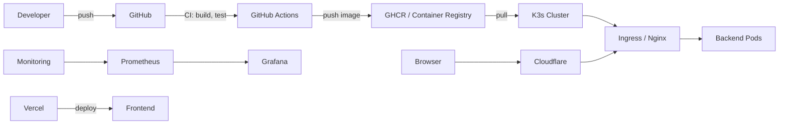

Referensi Deployment — Ringkasan

Tujuan

- Menyediakan dokumentasi ringkas sebagai referensi arsitektural untuk deployment proyek.
- Menjelaskan komponen, strategi deployment (rolling), rollback otomatis, CI/CD, containerization, IaC, dan monitoring.

Arsitektur (ringkas)

- K3s: cluster Kubernetes ringan sebagai main cluster (production).
- Nginx (Ingress Controller): reverse proxy / ingress untuk route dan TLS termination.
- Cloudflare: domain, DNS, dan SSL/TLS (Cloudflare fronting optional).
- GitHub Actions: main CI/CD runner untuk build, test, image push, dan deploy.
- Vercel: hosting dan CI/CD untuk frontend (terpisah dari backend).
- Monitoring: Prometheus + Grafana; backend expose metrics via `/actuator/prometheus`.

Diagram (mermaid)



CI/CD (rekomendasi alur)

1. Pull request triggers pipeline:
   - Run `./gradlew clean check` (unit tests, Checkstyle, Jacoco verification).
   - Build Docker image, run integration smoke tests (optional), push image to registry (tag: `sha` + `latest`).
   - Create a short-lived release / deployment preview (optional).
2. Merge ke `main` triggers production pipeline:
   - Build & push image.
   - Deploy to K3s via `kubectl rollout` (Deployment/Helm).
   - Wait for rollout status and healthchecks (`kubectl rollout status deployment/your-app --timeout=...`).
   - If rollout healthy → complete. Jika gagal → otomatis lakukan rollback (lihat bawah).

Contoh langkah deploy (GitHub Actions snippet)

```yaml
- name: Set up Kubeconfig
  uses: azure/setup-kubectl@v3
  with:
    version: "1.26.0"

- name: Deploy (kubectl set image + rollout)
  run: |
    kubectl -n production set image deployment/yomu-deployment yomu-container=ghcr.io/${{ github.repository_owner }}/yomu-forum:${{ github.sha }}
    kubectl -n production rollout status deployment/yomu-deployment --timeout=3m
```

Deployment Method — Rolling Deployment

- Rolling update (Kubernetes default): pods dimatikan satu-per-satu dan diganti dengan versi baru.
- Benefit: Zero downtime jika readiness/liveness probe dan replicas dikonfigurasi dengan benar.
- Konfigurasi penting:
  - `readinessProbe` dan `livenessProbe` di PodSpec.
  - `maxUnavailable: 1` dan `maxSurge: 1` (atau sesuai capacity) pada `Deployment.strategy.rollingUpdate`.

Rollback Method — Automatic Rollback

- Kubernetes: jika `kubectl rollout status` gagal atau readiness probe tidak lulus, jalankan `kubectl rollout undo deployment/yomu-deployment`.
- Implementasi di CI:
  - Gunakan `--wait`/`kubectl rollout status` dan exit non-zero pada kegagalan.
  - Pada failure handler, lakukan `kubectl rollout undo` untuk otomatis rollback ke revision sebelumnya.
- Opsi lain: gunakan image tag immutability (sha) dan simpan daftar image sebelumnya untuk recovery manual atau otomatis.

Contoh script rollback otomatis (bash)

```bash
kubectl -n production set image deployment/yomu-deployment yomu-container=$NEW_IMAGE
if ! kubectl -n production rollout status deployment/yomu-deployment --timeout=3m; then
  kubectl -n production rollout undo deployment/yomu-deployment
  exit 1
fi
```

Infrastructure as Code (IaC)

- Rekomendasi: Terraform untuk provisioning cloud resources (DNS, registry, infra yang mendukung K3s), dan Helm untuk packaging aplikasi/Kubernetes resources.
- Contoh yang tersedia di repo: `infra/terraform/*` (sample Koyeb provider). Untuk k3s, gunakan Terraform + provider yang relevan atau gunakan `k3sup`/Ansible untuk bootstrap k3s.

Monitoring & Observability

- Backend exposes Prometheus metrics (`/actuator/prometheus`) dan health (`/actuator/health`).
- Prometheus scrape job targets aplikasi di cluster atau via sidecar.
- Alerting rules: instance down, high error rate, high latency.
- Grafana dashboards untuk JVM (memory, GC), HTTP request rates, error rates, and business metrics (e.g., comments per minute).

Operational Notes

- Secrets: store tokens and kubeconfigs as repo secrets (`secrets.KOYEB_API_TOKEN`, `secrets.KUBE_CONFIG`, etc.).
- Action pinning: pin third-party GitHub Actions to full commit SHAs for supply-chain security.
- Permissions: minimize `permissions` in workflows (e.g., `contents: read`, `packages: write` only when needed).

Variasi: Koyeb vs K3s

- Koyeb: serverless container platform; easier devops for small teams — you can push image and let Koyeb manage infra.
- K3s: self-managed Kubernetes cluster gives full control and supports rolling updates/advanced strategies (blue/green, canary) with more ops overhead.
- Pilihan tergantung kebutuhan tim: untuk learning/project, K3s is fine; for simple ops, Koyeb can be faster to operate.

Rekomendasi cepat untuk tugas akhir (skor 0..4)

- Untuk mencapai skor 2: pastikan CI/CD automasi (build, test, push), IaC sample tersedia, metrics sampai ke Prometheus, dan dashboard Grafana tersedia.
- Untuk skor 3: tambahkan strategi deployment (canary atau blue/green) dan dokumentasikan pilihan serta justifikasi.
- Untuk skor 4: tambahkan automated rollback, load balancing, disaster recovery steps, and run a demo show (rollback working).

Sumber & referensi cepat

- Kubernetes Rolling Update: https://kubernetes.io/docs/tutorials/kubernetes-basics/update/
- Helm: https://helm.sh/
- Prometheus: https://prometheus.io/
- GitHub Actions: https://docs.github.com/en/actions

---

File ini dibuat sebagai referensi ringkas. Beritahu saya jika mau saya tambahkan contoh `Deployment` YAML, `HelmChart`, atau template GitHub Actions untuk canary/blue-green deployment.
